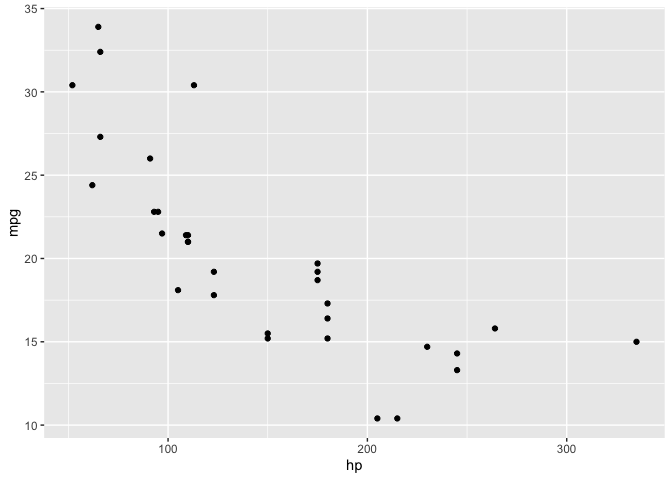

<!-- README.md is generated from README.Rmd. Please edit that file -->

# rsgl

<!-- badges: start -->

[](https://github.com/sgl-projects/rsgl/actions/workflows/R-CMD-check.yaml)
<!-- badges: end -->

This project implements the [SGL graphics
language](https://arxiv.org/pdf/2505.14690).

## Usage

The interface to rsgl is the `dbGetPlot` function, which takes a DuckDB
connection and a SGL statement and returns a plot. The example below
demonstrates creating an in-memory DuckDB database, loading data, and
generating a scatterplot.

``` r
library(duckdb)
#> Loading required package: DBI
library(rsgl)

con <- dbConnect(duckdb())
dbWriteTable(con, "cars", mtcars)
dbGetPlot(con, "
    visualize
        hp as x,
        mpg as y
    from cars
    using points
")
```


