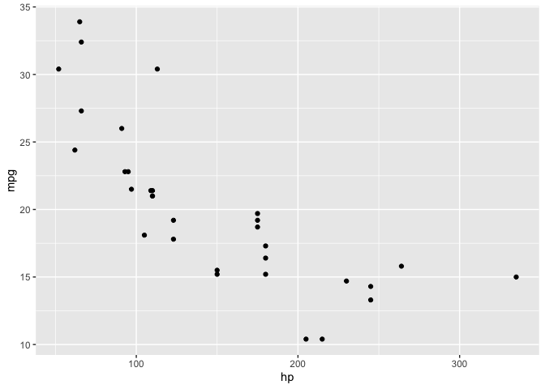

<!-- README.md is generated from README.Rmd. Please edit that file -->

# rsgl

<!-- badges: start -->

[](https://github.com/sgl-projects/rsgl/actions/workflows/R-CMD-check.yaml)
<!-- badges: end -->

rsgl implements the [SGL graphics
language](https://arxiv.org/pdf/2505.14690) for use within R. SGL is a
graphics language that is designed to look and feel like SQL, and is
based on the grammar of graphics.

## Installation

rsgl is not yet available on CRAN but can be installed from GitHub with:

``` r
# install.packages("devtools")
devtools::install_github("sgl-projects/rsgl")
```

## Usage

`dbGetPlot` is the primary interface to rsgl. It takes a
[DBI](https://dbi.r-dbi.org) database connection and a SGL statement and
returns a [ggplot2](https://ggplot2.tidyverse.org) plot.

The following example demonstrates creating a DBI connection to an
in-memory [DuckDB](https://duckdb.org) database, loading it with data,
and then generating a scatterplot from a SGL statement.

``` r
library(duckdb)
#> Warning: package 'duckdb' was built under R version 4.5.2
#> Loading required package: DBI
#> Warning: package 'DBI' was built under R version 4.5.2
library(rsgl)

con <- dbConnect(duckdb())
dbWriteTable(con, "cars", mtcars)

dbGetPlot(con, "
    visualize
        hp as x,
        mpg as y
    from cars
    using points
")
```


