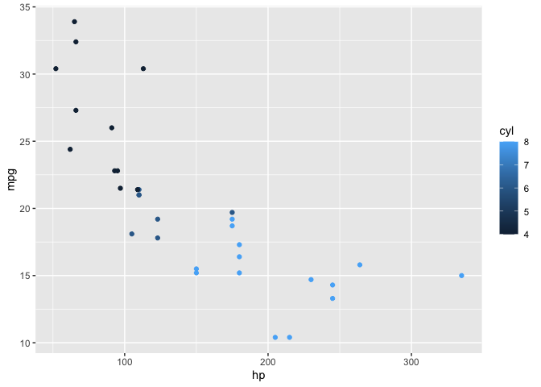
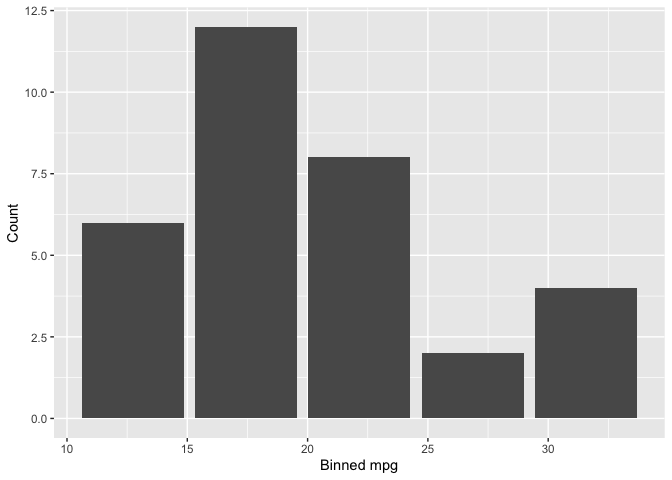
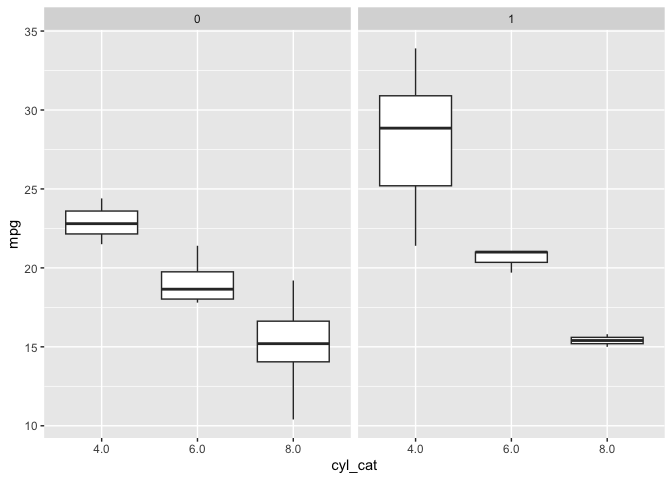

<!-- README.md is generated from README.Rmd. Please edit that file -->

# rsgl

<!-- badges: start -->

[](https://github.com/sgl-projects/rsgl/actions/workflows/R-CMD-check.yaml)
<!-- badges: end -->

rsgl implements [SGL (Structured Graphics
Language)](https://arxiv.org/pdf/2505.14690), a declarative language for
specifying statistical graphics that is designed to feel like SQL. You
write a SGL statement, pass it to `dbGetPlot()` with a DuckDB
connection, and get back a ggplot2 plot.

## Installation

You can install rsgl from GitHub with:

``` r
# install.packages("remotes")
remotes::install_github("sgl-projects/rsgl")
```

## Examples

### Scatterplot

``` r
dbGetPlot(con, "
  visualize
    hp as x,
    mpg as y,
    cyl as color
  from cars
  using points
")
```



### Histogram

``` r
dbGetPlot(con, "
  visualize
    bin(mpg) as x,
    count(*) as y
  from cars
  group by
    bin(mpg)
  using bars
")
```



### Scatterplot with regression line

``` r
dbGetPlot(con, "
  visualize
    hp as x,
    mpg as y
  from cars
  using (
    points
    layer
    regression line
  )
  scale by
    log(x)
")
#> `geom_smooth()` using formula = 'y ~ x'
```


### Faceted box plot

``` r
dbGetPlot(con, "
  visualize
    cyl_cat as x,
    mpg as y
  from (
    select mpg, cast(cyl as varchar) as cyl_cat, am
    from cars
  )
  using boxes
  facet by
    am
")
```



## Learn more

- `vignette("rsgl")` — Get started with rsgl
- `vignette("sgl-language-guide")` — Full SGL syntax reference
