# Example Gallery

A collection of SGL examples organized by plot type. Each example is a
self-contained SGL statement you can copy and adapt. For a full syntax
reference, see
[`vignette("sgl-language-guide")`](https://sgl-projects.github.io/rsgl/articles/sgl-language-guide.md).

## Scatterplots

### Basic scatterplot

``` r
dbGetPlot(con, "
  visualize
    hp as x,
    mpg as y
  from cars
  using points
")
```


### Colored by group

``` r
dbGetPlot(con, "
  visualize
    hp as x,
    mpg as y,
    cyl as color
  from cars
  using points
")
```

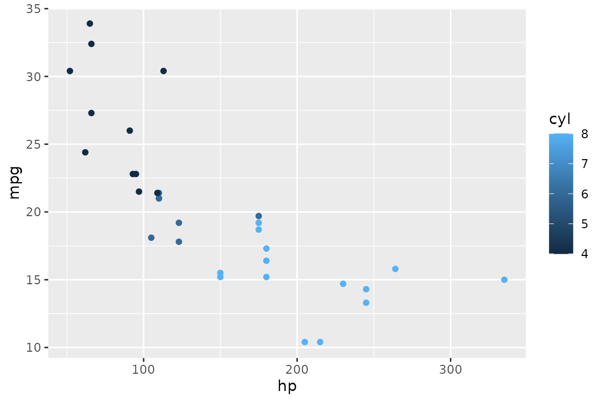

### Sized by variable

``` r
dbGetPlot(con, "
  visualize
    hp as x,
    mpg as y,
    wt as size
  from cars
  using points
")
```

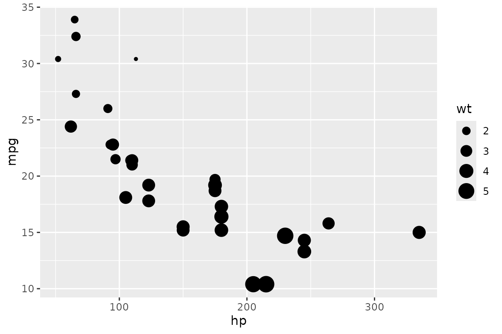

### With regression line

``` r
dbGetPlot(con, "
  visualize
    hp as x,
    mpg as y
  from cars
  using (
    points
    layer
    regression line
  )
")
```


### Jittered points

``` r
set.seed(42)
dbGetPlot(con, "
  visualize
    cyl_cat as x,
    mpg as y
  from (
    select mpg, cast(cyl as varchar) as cyl_cat
    from cars
  )
  using jittered points
")
```


### Filtered with SQL subquery

``` r
dbGetPlot(con, "
  visualize
    hp as x,
    mpg as y,
    cyl as color
  from (
    select
      hp, mpg,
      cyl::varchar as cyl
    from cars
    where cyl = 4 or cyl = 6
  )
  using points
")
```

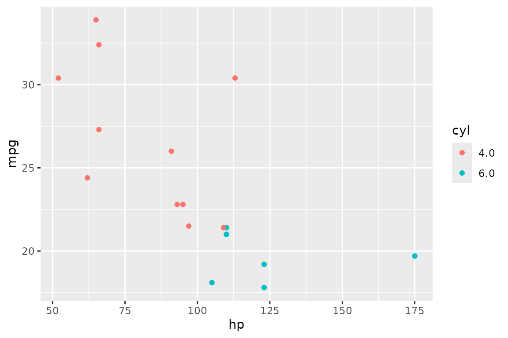

## Bar charts

### Counts per category

``` r
dbGetPlot(con, "
  visualize
    cut as x,
    count(*) as y
  from diamonds
  group by
    cut
  using bars
")
```


### Stacked bars

``` r
dbGetPlot(con, "
  visualize
    cut as x,
    count(*) as y,
    color as color
  from diamonds
  group by
    cut, color
  using bars
")
```

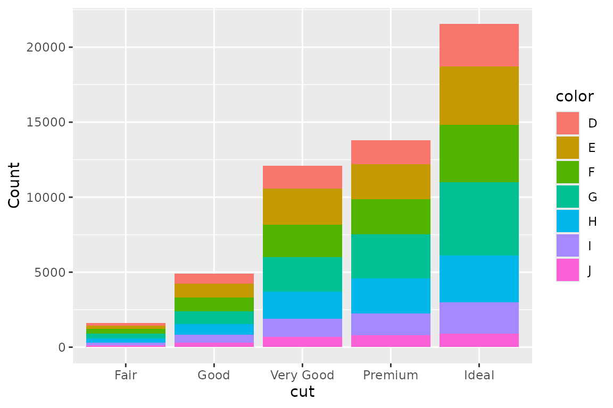

### Unstacked (dodged) bars

``` r
dbGetPlot(con, "
  visualize
    cut as x,
    count(*) as y,
    color as color
  from diamonds
  group by
    cut, color
  using unstacked bars
")
```

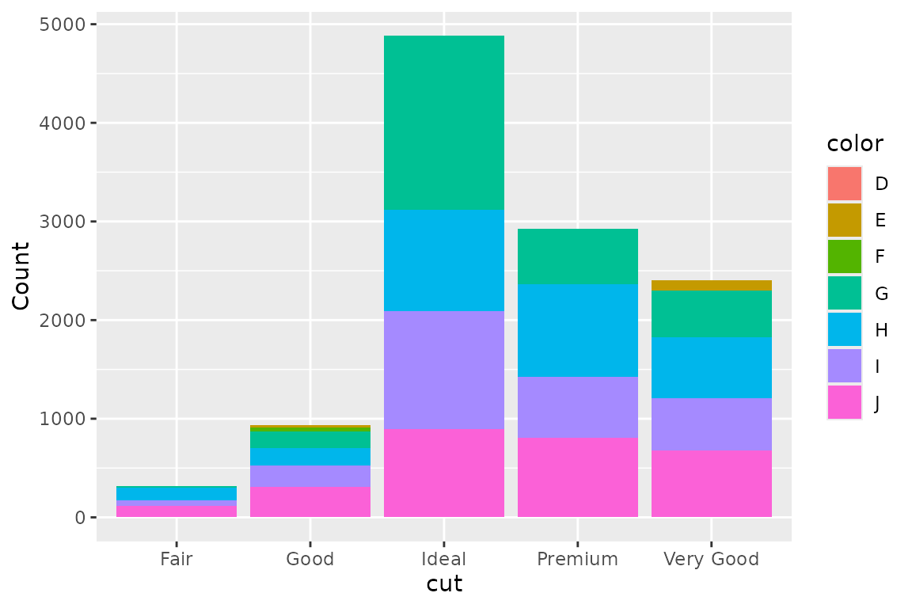

## Histograms

### Basic histogram

``` r
dbGetPlot(con, "
  visualize
    bin(mpg) as x,
    count(*) as y
  from cars
  group by
    bin(mpg)
  using bars
")
```


### Stacked histogram by group

``` r
dbGetPlot(con, "
  visualize
    bin(mpg) as x,
    count(*) as y,
    cyl_cat as color
  from (
    select *, cast(cyl as varchar) as cyl_cat
    from cars
  )
  group by
    bin(mpg), cyl_cat
  using bars
")
```


## Line plots

### Single line

``` r
dbGetPlot(con, "
  visualize
    age as x,
    circumference as y
  from trees
  using line
")
```

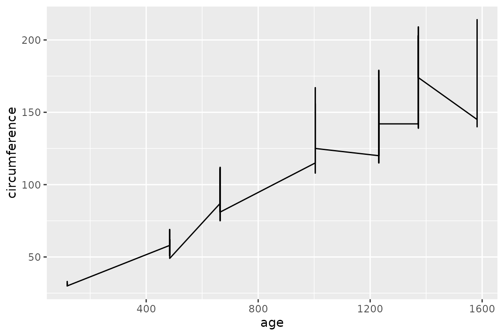

### Multiple lines with collect by

``` r
dbGetPlot(con, "
  visualize
    age as x,
    circumference as y
  from trees
  collect by
    Tree
  using lines
")
```

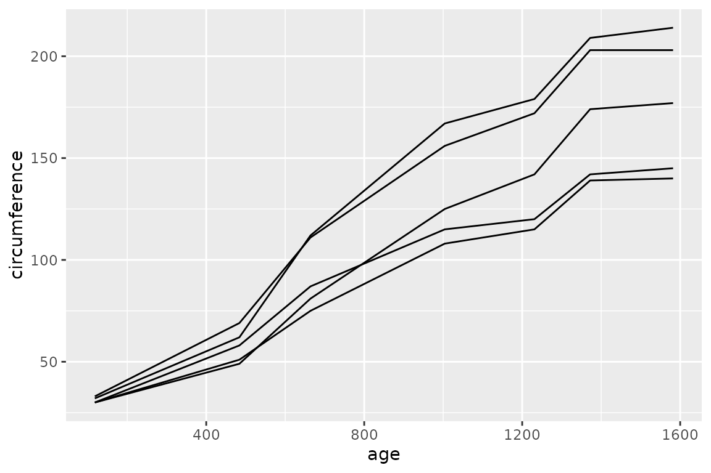

### Regression lines by group

``` r
dbGetPlot(con, "
  visualize
    hp as x,
    mpg as y,
    cyl as color
  from (
    select hp, mpg, cyl::varchar as cyl
    from cars
  )
  using regression lines
")
```

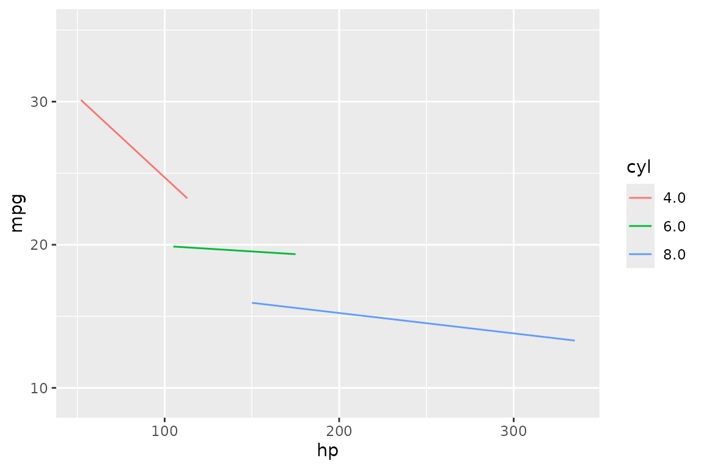

## Box plots

### Basic box plot

``` r
dbGetPlot(con, "
  visualize
    cut as x,
    price as y
  from diamonds
  using boxes
")
```

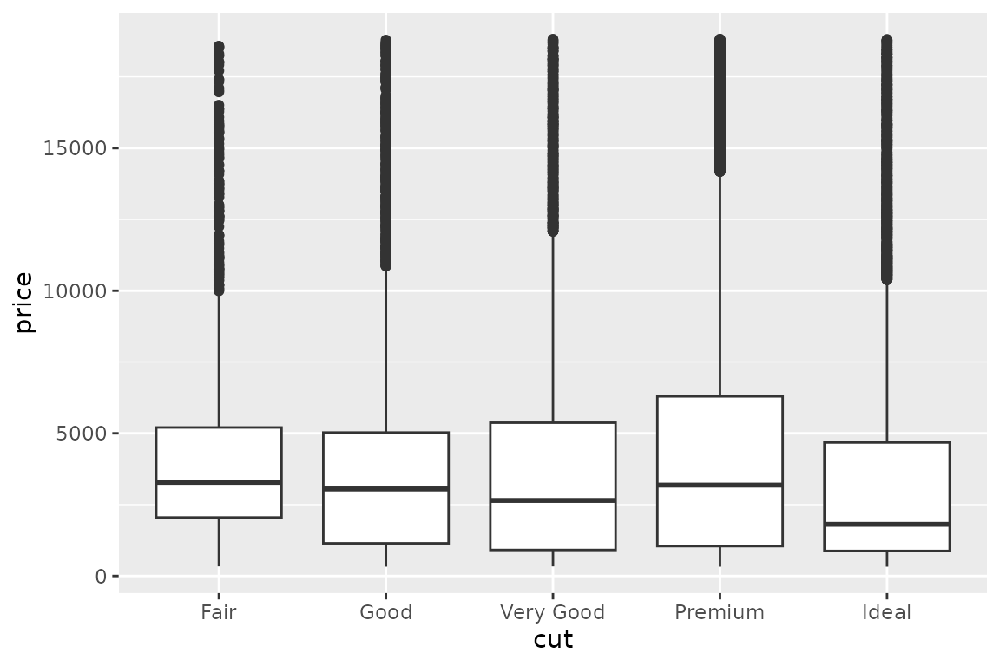

## Pie charts

A pie chart is a stacked bar chart in polar coordinates. Map a count to
`theta` and a category to `color`:

``` r
dbGetPlot(con, "
  visualize
    count(*) as theta,
    cut as color
  from diamonds
  group by
    cut
  using bars
")
```

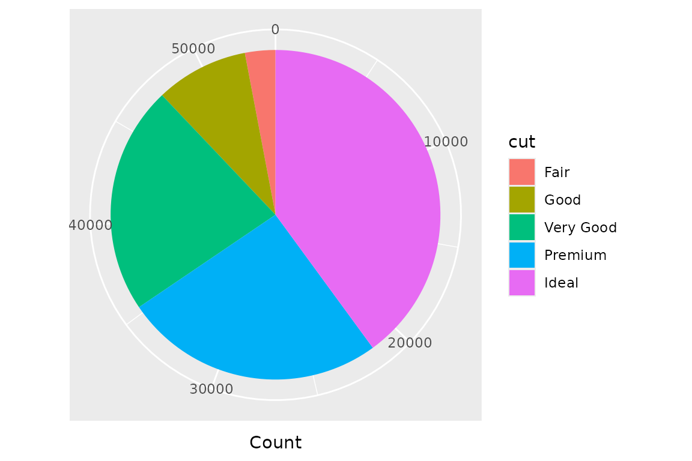

## Faceted plots

### Horizontal facets

``` r
dbGetPlot(con, "
  visualize
    hp as x,
    mpg as y
  from cars
  using points
  facet by
    cyl
")
```

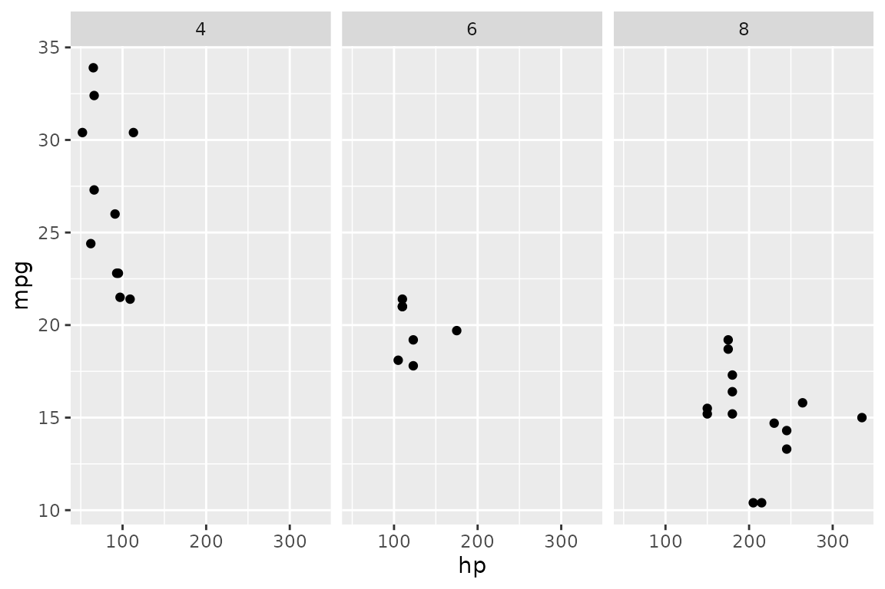

### Vertical facets

``` r
dbGetPlot(con, "
  visualize
    hp as x,
    mpg as y
  from cars
  using points
  facet by
    cyl vertically
")
```

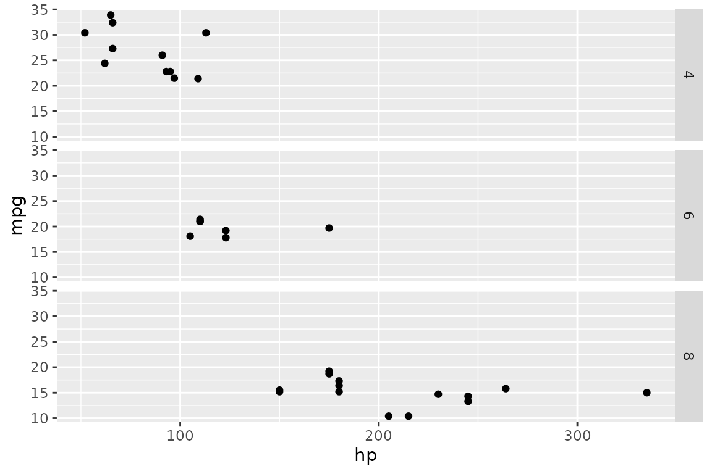

### Facet grid

``` r
dbGetPlot(con, "
  visualize
    hp as x,
    mpg as y
  from cars
  using points
  facet by
    cyl,
    am
")
```


## Log-scaled plots

``` r
dbGetPlot(con, "
  visualize
    hp as x,
    mpg as y
  from cars
  using (
    points
    layer
    regression line
  )
  scale by
    log(x),
    log(y)
")
```

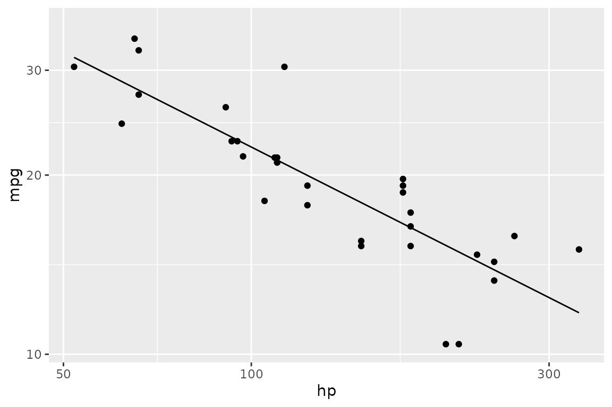

## Multi-layer plots

### Points and regression line

``` r
dbGetPlot(con, "
  visualize
    hp as x,
    mpg as y
  from cars
  using points

  layer

  visualize
    hp as x,
    mpg as y
  from cars
  using regression line
")
```


### Custom titles

``` r
dbGetPlot(con, "
  visualize
    hp as x,
    mpg as y,
    cyl as color
  from cars
  using points
  title
    x as 'Horsepower',
    y as 'Miles Per Gallon',
    color as 'Cylinders'
")
```


