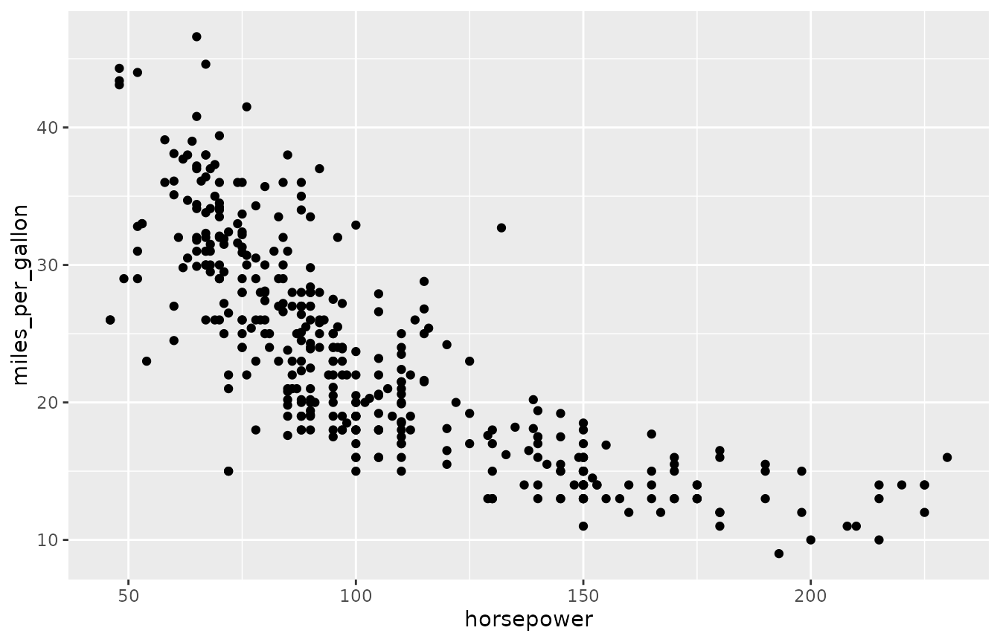
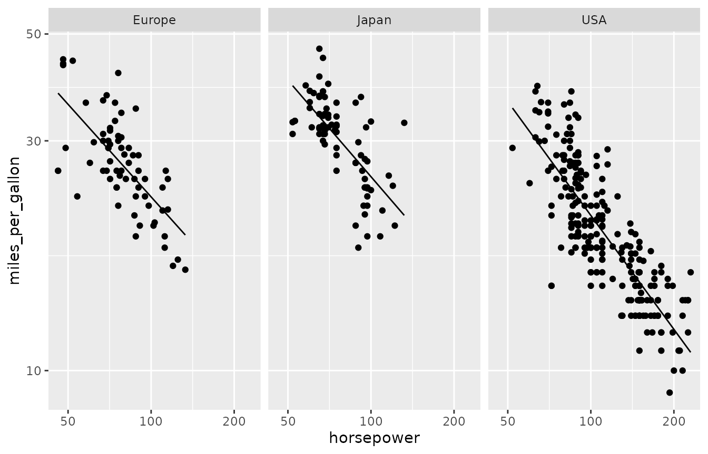
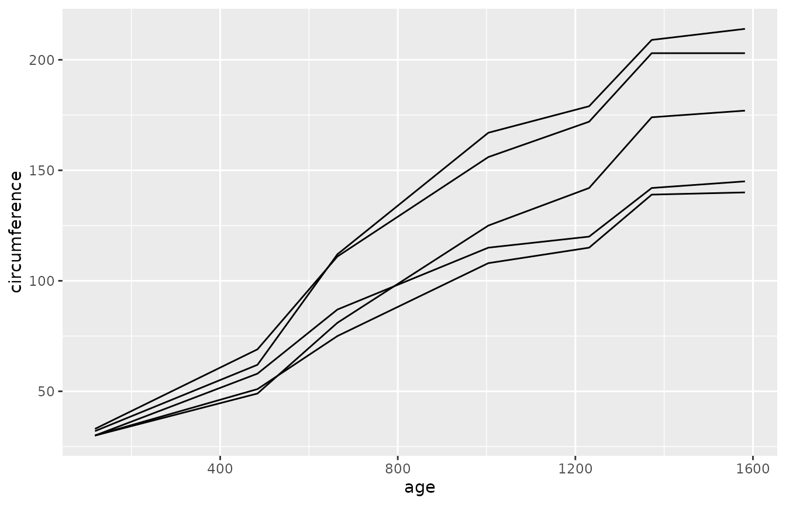

# Example gallery

## Database Setup

The examples on this page will use an in-memory
[DuckDB](https://duckdb.org) database loaded with data. Multiple
datasets are used and the page is organized by the dataset being
analyzed.

``` r

library(rsgl)
#> 
#> Attaching package: 'rsgl'
#> The following objects are masked from 'package:datasets':
#> 
#>     cars, trees
library(duckdb)
#> Loading required package: DBI

con <- dbConnect(duckdb())
```

## Cars

### Setup

``` r

dbWriteTable(con, "cars", cars)
dbGetQuery(con, "
  select *
  from cars
  limit 5
")
#>   car_id horsepower miles_per_gallon origin year
#> 1      1        130               18    USA 1970
#> 2      2        165               15    USA 1970
#> 3      3        150               18    USA 1970
#> 4      4        150               16    USA 1970
#> 5      5        140               17    USA 1970
```

### Example Plots

``` r

dbGetPlot(con, "
  visualize
    horsepower as x,
    miles_per_gallon as y
  from cars
  using points
")
```



------------------------------------------------------------------------

``` r

dbGetPlot(con, "
  visualize
    bin(miles_per_gallon) as x,
    count(*) as y
  from cars
  group by
    bin(miles_per_gallon)
  using bars
")
```



## Trees

### Setup

``` r

dbWriteTable(con, "trees", trees)
dbGetQuery(con, "
  select *
  from trees
  limit 5
")
#>   tree_id  age circumference
#> 1       1  118            30
#> 2       1  484            58
#> 3       1  664            87
#> 4       1 1004           115
#> 5       1 1231           120
```

### Example Plots

``` r

dbGetPlot(con, "
  visualize
    age as x,
    circumference as y
  from trees
  collect by
    tree_id
  using lines
")
```


