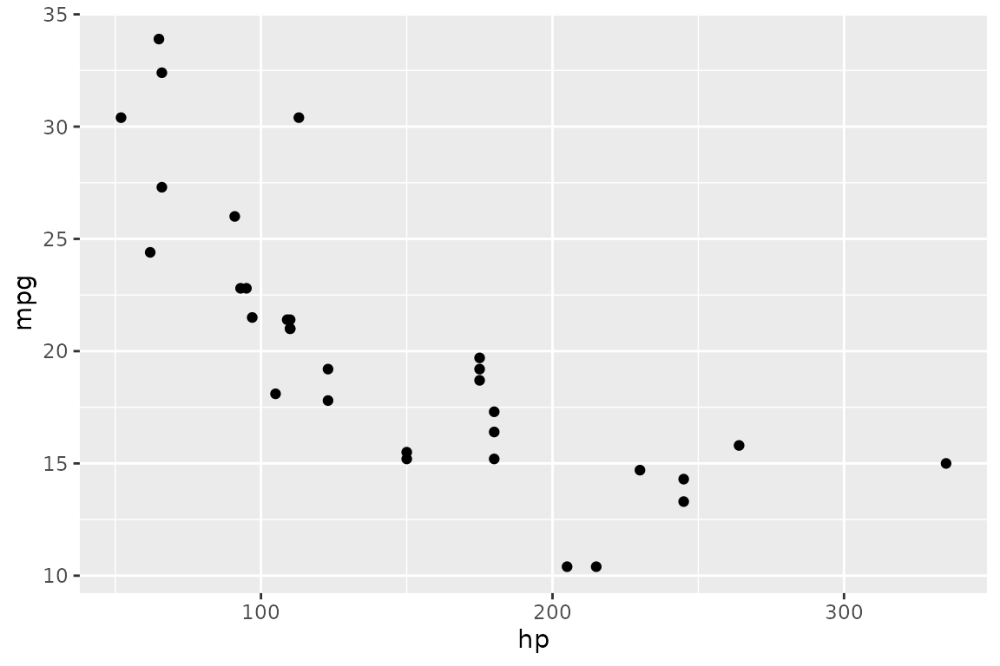
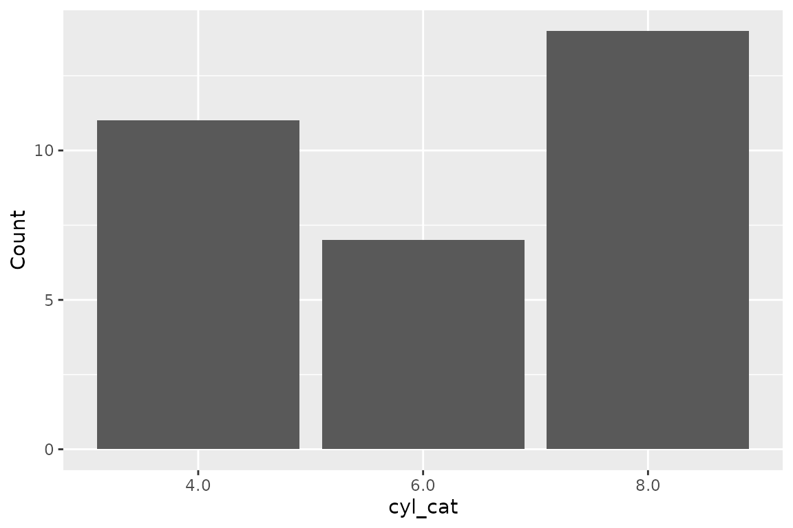
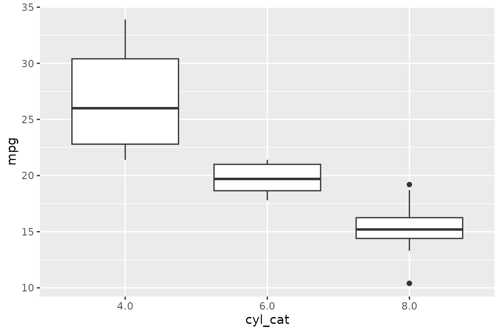

# Get Started with rsgl

## What is SGL?

SGL (Structured Graphics Language) is a declarative language for
generating statistical graphics from relational data. It is designed to
feel like SQL — if you can write a `SELECT` statement, you can write an
SGL statement.

rsgl implements SGL as an R package. You pass an SGL statement and a
DuckDB connection to
[`dbGetPlot()`](https://sgl-projects.github.io/rsgl/reference/dbGetPlot.md),
and it returns a ggplot2 plot object.

## Setup

Install rsgl from GitHub:

``` r
# install.packages("remotes")
remotes::install_github("sgl-projects/rsgl")
```

Load the package and create a DuckDB connection with some data:

``` r
library(rsgl)
library(duckdb)
#> Loading required package: DBI

con <- dbConnect(duckdb())
dbWriteTable(con, "cars", mtcars)
```

The `cars` table now contains the `mtcars` dataset with columns like
`hp` (horsepower), `mpg` (miles per gallon), `cyl` (cylinders), and `wt`
(weight).

## Your first plot

An SGL statement has three required parts:

- **`visualize`** — maps columns to visual properties (aesthetics)
- **`from`** — specifies the data source
- **`using`** — chooses the geometric object (geom)

``` r
dbGetPlot(con, "
  visualize
    hp as x,
    mpg as y
  from cars
  using points
")
```



This maps `hp` to the x-axis and `mpg` to the y-axis, pulls data from
the `cars` table, and draws a point for each row.

## Adding color

Map a third column to the `color` aesthetic to distinguish groups:

``` r
dbGetPlot(con, "
  visualize
    hp as x,
    mpg as y,
    cyl as color
  from cars
  using points
")
```


## Changing geoms

Swap `points` for a different geom to change the representation. Use
`bars` for a bar chart — here combined with `count(*)` to count rows per
group:

``` r
dbGetPlot(con, "
  visualize
    cyl_cat as x,
    count(*) as y
  from (
    select cast(cyl as varchar) as cyl_cat
    from cars
  )
  group by
    cyl_cat
  using bars
")
```



Use `line` for a line chart, and `boxes` for box plots:

``` r
dbGetPlot(con, "
  visualize
    cyl_cat as x,
    mpg as y
  from (
    select mpg, cast(cyl as varchar) as cyl_cat
    from cars
  )
  using boxes
")
```



## Layering

Combine multiple geoms with the `layer` keyword. This overlays a
regression line on a scatterplot:

``` r
dbGetPlot(con, "
  visualize
    hp as x,
    mpg as y
  from cars
  using (
    points
    layer
    regression line
  )
")
#> `geom_smooth()` using formula = 'y ~ x'
```


## Next steps

The [SGL Language
Guide](https://sgl-projects.github.io/rsgl/articles/sgl-language-guide.md)
covers the full syntax including transformations (`bin`, `count`),
grouping, collection, scaling, faceting, coordinate systems, and titles.
