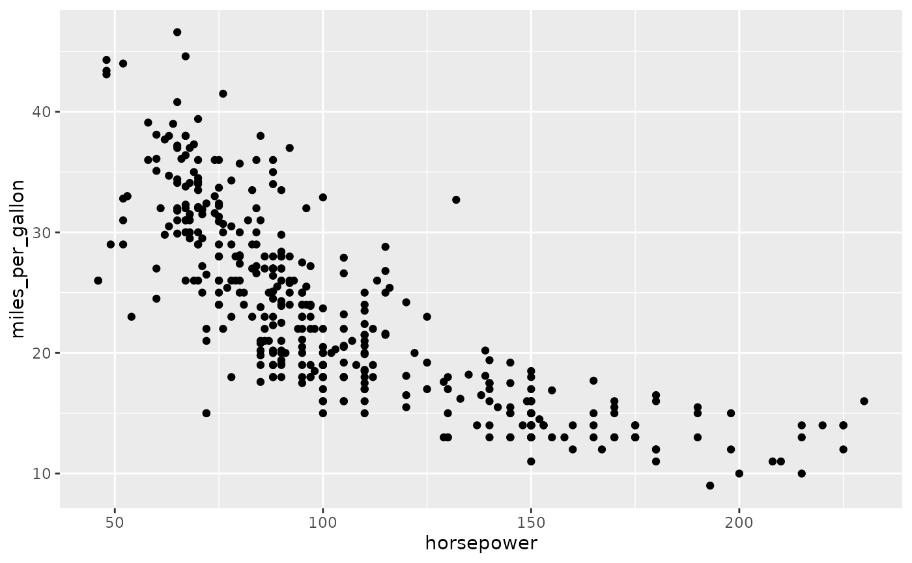
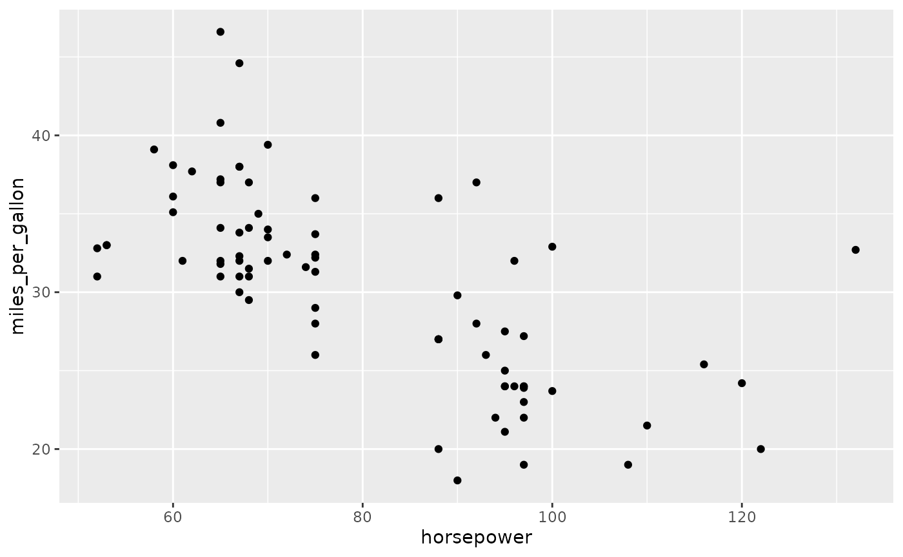
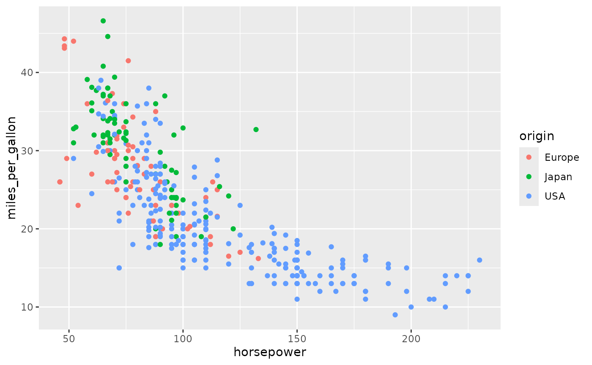
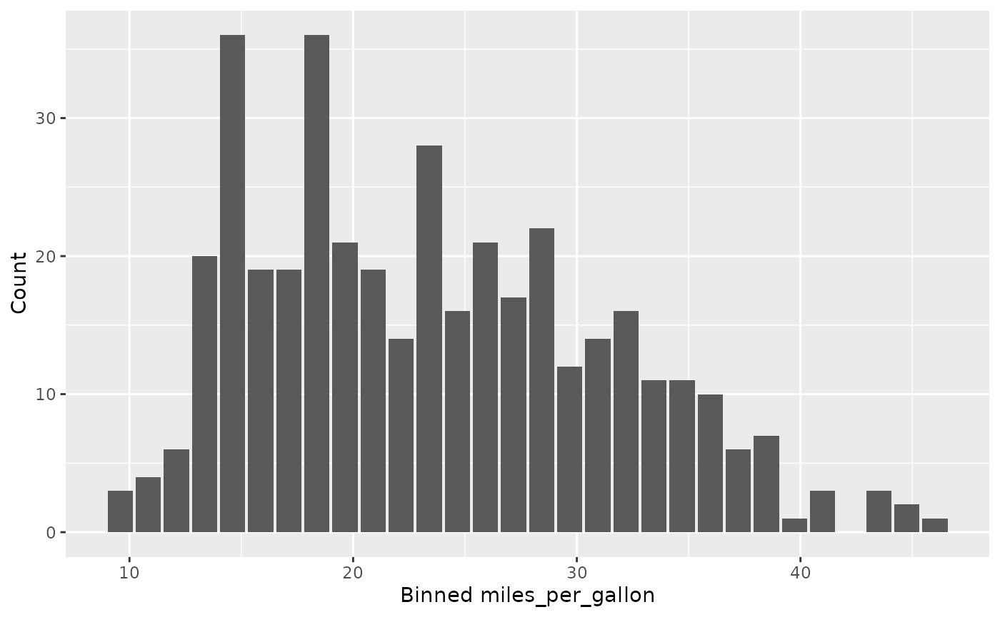
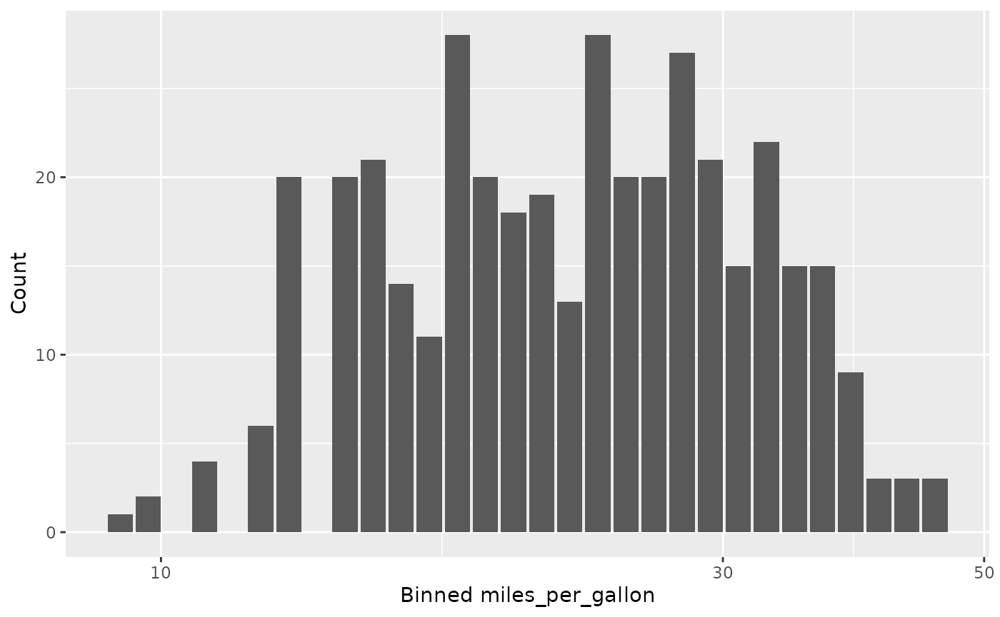
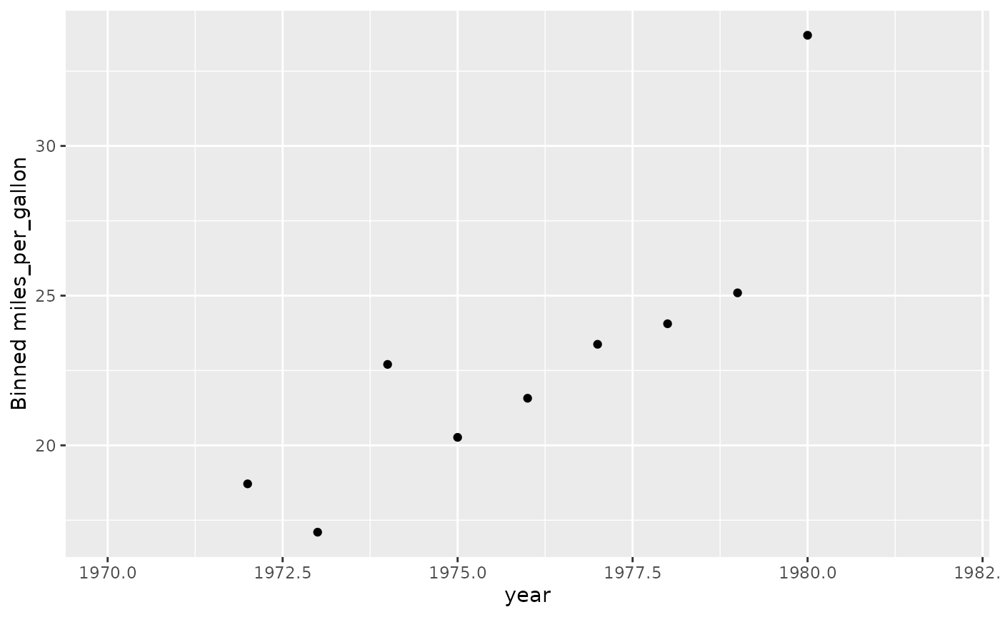
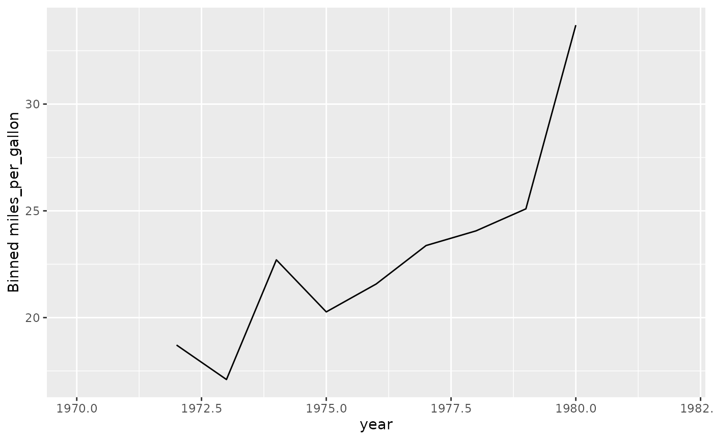
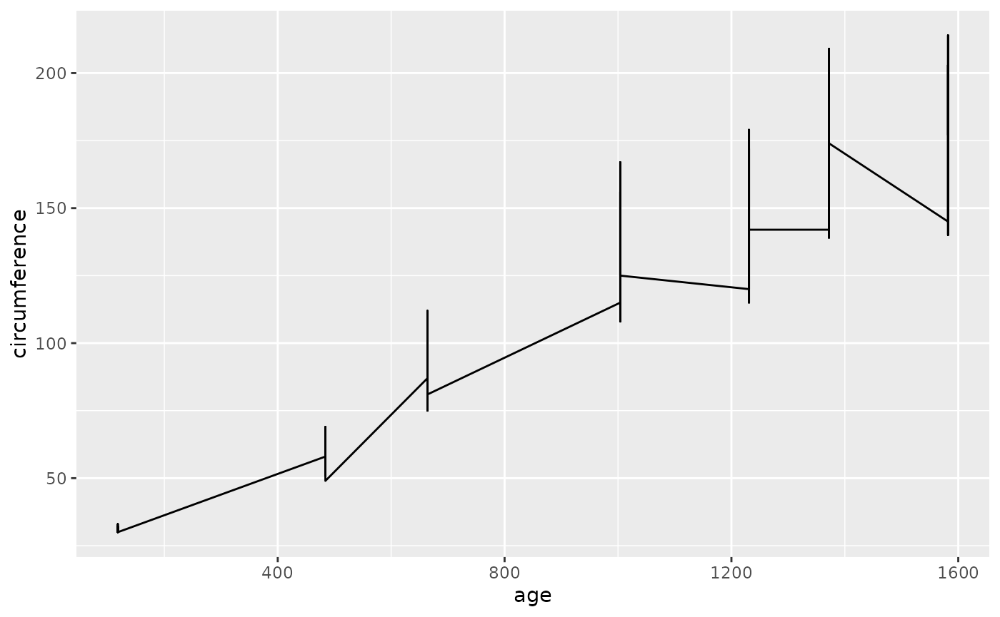
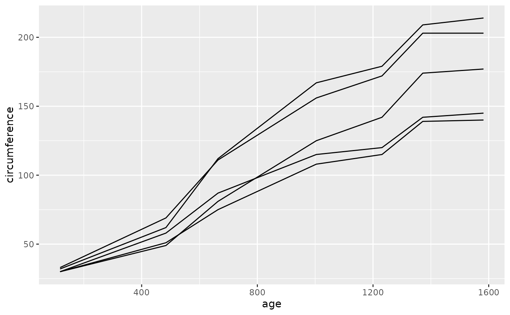

# Get started with rsgl

This tutorial introduces the SGL language as well as usage of the rsgl
package.

## Setup

For use with the examples in this tutorial, we will create an in-memory
[DuckDB](https://duckdb.org) database and load it with two tables,
`cars` and `trees`.

``` r

library(rsgl)
#> 
#> Attaching package: 'rsgl'
#> The following objects are masked from 'package:datasets':
#> 
#>     cars, trees
library(duckdb)
#> Loading required package: DBI

con <- dbConnect(duckdb())
dbWriteTable(con, "cars", cars)
dbWriteTable(con, "trees", trees)
```

Let’s query each to view a sample of data:

``` r

dbGetQuery(con, "
  select *
  from cars
  limit 5
")
#>   car_id horsepower miles_per_gallon origin year
#> 1      1        130               18    USA 1970
#> 2      2        165               15    USA 1970
#> 3      3        150               18    USA 1970
#> 4      4        150               16    USA 1970
#> 5      5        140               17    USA 1970
```

``` r

dbGetQuery(con, "
  select *
  from trees
  limit 5
")
#>   tree_id  age circumference
#> 1       1  118            30
#> 2       1  484            58
#> 3       1  664            87
#> 4       1 1004           115
#> 5       1 1231           120
```

## dbGetPlot

The primary interface to rsgl is the `dbGetPlot` function, which takes a
[DBI](https://dbi.r-dbi.org) database connection and a SGL statement and
returns a [ggplot2](https://ggplot2.tidyverse.org) plot. Although the
examples in this tutorial use a connection to a DuckDB database,
`dbGetPlot` will accept any DBI connection.

## The SGL Language

### The From Clause

The `from` keyword precedes a data source specification, which is often
the name of a table in the database. Here, we specify the `cars` table
as the data source.

``` r

dbGetPlot(con, "
  visualize
    horsepower as x,
    miles_per_gallon as y
  from cars
  using points
")
#> Warning: Removed 14 rows containing missing values or values outside the scale range
#> (`geom_point()`).
```



This is similar in usage to the `from` keyword in SQL, except that only
a single data source is allowed (i.e., a comma-separated list of table
names is not valid). If data from multiple sources or pre-processing of
data is necessary, then a SQL subquery can be provided:

``` r

dbGetPlot(con, "
  visualize
    horsepower as x,
    miles_per_gallon as y
  from (
    select *
    from cars
    where origin = 'Japan'
  )
  using points
")
```



### The Using Clause

The `using` keyword precedes the name of the geometric object(s) that
will represent the data. Following ggplot2 terminology, these geometric
objects are referred to as geoms. Our previous examples demonstrated
representing data with point geoms.

### The Visualize Clause

The `visualize` keyword precedes the aesthetic-to-column mapping, which
maps perceivable traits of the geoms to data source columns. Our prior
examples mapped the `x` and `y` positions of the point geoms to data
source columns. However, aesthetics may be non-positional, as shown
below. The `visualize` keyword most closely resembles the `select`
keyword within SQL.

``` r

dbGetPlot(con, "
  visualize
    horsepower as x,
    miles_per_gallon as y,
    origin as color
  from cars
  using points
")
#> Warning: Removed 14 rows containing missing values or values outside the scale range
#> (`geom_point()`).
```



In addition to mapping aesthetics to columns, aesthetics can be mapped
to expressions that include transformations and aggregations.

### Column-Level Transformations and Aggregations

SGL supports column-level transformations and aggregations, as shown
below where a binning transformation is combined with a count
aggregation to produce a histogram on `miles_per_gallon`.

``` r

dbGetPlot(con, "
  visualize
    bin(miles_per_gallon) as x,
    count(*) as y
  from cars
  group by
    bin(miles_per_gallon)
  using bars
")
#> Warning: Removed 1 row containing missing values or values outside the scale range
#> (`geom_bar()`).
```



Here we see that, similarly to SQL, SGL has a `group by` clause where
aggregation groupings are specified.

Although SQL itself supports column-level transformation, grouping, and
aggregation, it is desirable for SGL to provide additional support for
these operations. Statistical graphics often require operations such as
binning that are not natively supported by SQL. Additionally, SGL’s
column-level transformations and aggregations are performed after
scaling, which cannot easily be replicated using SQL. Below is an
example of this feature, where binning and counting are applied after
log scaling, resulting in a log-scaled histogram.

``` r

dbGetPlot(con, "
  visualize
    bin(miles_per_gallon) as x,
    count(*) as y
  from cars
  group by
    bin(miles_per_gallon)
  using bars
  scale by
    log(x)
")
#> Warning: Removed 1 row containing missing values or values outside the scale range
#> (`geom_bar()`).
```



### The Collect By Clause

In SGL, a geom is classified as individual if it represents each record
(after transformation and aggregation) by a distinct geometric object.
Alternatively, a geom is classified as collective if it represents
multiple records by one geometric object. For example, points and lines
are individual and collective geoms, respectively, as shown below where
the same data is represented using each.

``` r

dbGetPlot(con, "
  visualize
    year as x,
    avg(miles_per_gallon) as y
  from cars
  group by
    year
  using points
")
#> Warning: Removed 3 rows containing missing values or values outside the scale range
#> (`geom_point()`).
```



``` r

dbGetPlot(con, "
  visualize
    year as x,
    avg(miles_per_gallon) as y
  from cars
  group by
    year
  using line
")
#> Warning: Removed 3 rows containing missing values or values outside the scale range
#> (`geom_line()`).
```



For collective geoms, the collection of records to represent by each
object is determined automatically using reasonable defaults. This
behavior can be overridden by providing explicit collections in the
`collect by` clause. The `collect by` clause is similar to the
`group by` clause, except that rather than defining groups to aggregate
by, the `collect by` clause defines collections of records to be
represented by one object. Below we see an example where the default
collection is not ideal, followed by a preferrable explicit collection.

``` r

dbGetPlot(con, "
  visualize
    age as x,
    circumference as y
  from trees
  using line
")
```



``` r

dbGetPlot(con, "
  visualize
    age as x,
    circumference as y
  from trees
  collect by
    tree_id
  using lines
")
```


