# SGL Language Guide

This guide covers the full syntax of SGL (Structured Graphics Language)
as implemented in rsgl. For the formal language specification, see
[Chapman (2025)](https://arxiv.org/pdf/2505.14690).

## Setup

All examples use
[`dbGetPlot()`](https://sgl-projects.github.io/rsgl/reference/dbGetPlot.md),
which takes a DuckDB connection and a SGL statement. We’ll load some
datasets into an in-memory DuckDB database to work with.

``` r
library(rsgl)
library(duckdb)
#> Loading required package: DBI

con <- dbConnect(duckdb())
dbWriteTable(con, "cars", mtcars)
dbWriteTable(con, "trees", as.data.frame(Orange))

diamonds <- ggplot2::diamonds
diamonds$cut <- as.character(diamonds$cut)
diamonds$color <- as.character(diamonds$color)
diamonds$clarity <- as.character(diamonds$clarity)
dbWriteTable(con, "diamonds", diamonds)
```

## Statement structure

A SGL statement is built from clauses. A minimal statement has three:
`visualize`, `from`, and `using`. Additional clauses control grouping,
scaling, faceting, and titles. The statement ends with a semicolon
(optional when passed as a string to
[`dbGetPlot()`](https://sgl-projects.github.io/rsgl/reference/dbGetPlot.md)).

    visualize
      <aesthetic mappings>
    from <data source>
    [group by <grouping expressions>]
    [collect by <collection expressions>]
    using <geom expression>
    [scale by <scale expressions>]
    [facet by <facet expressions>]
    [title <title expressions>]

## The `from` clause

The `from` clause specifies the data source. This is typically a table
name:

``` r
dbGetPlot(con, "
  visualize
    hp as x,
    mpg as y
  from cars
  using points
")
```


A SQL subquery can be used for filtering or transforming data before
visualization. The subquery must be enclosed in parentheses:

``` r
dbGetPlot(con, "
  visualize
    hp as x,
    mpg as y
  from (
    select hp, mpg
    from cars
    where hp < 200
  )
  using points
")
```

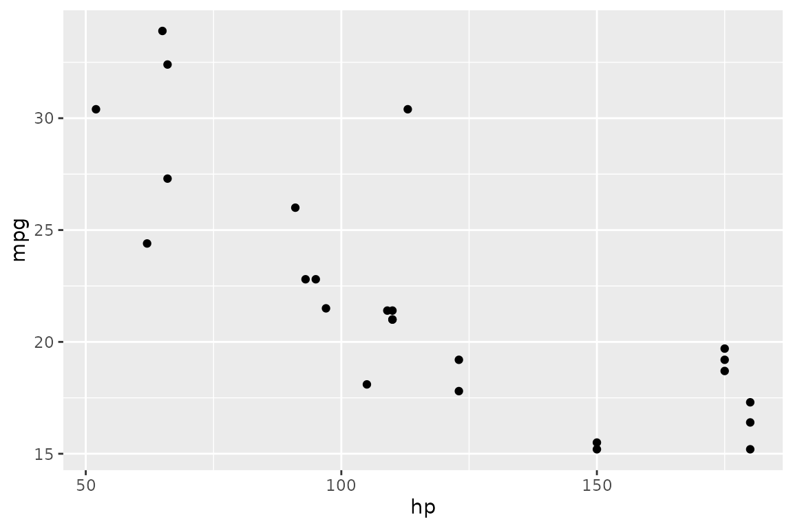

## The `visualize` clause

The `visualize` clause maps data source columns to aesthetics. Each
mapping has the form `<column> as <aesthetic>`.

### Positional aesthetics

Cartesian coordinates use `x` and `y`:

``` r
dbGetPlot(con, "
  visualize
    hp as x,
    mpg as y
  from cars
  using points
")
```


Polar coordinates use `theta` (angle) and `r` (radius) — see the
[coordinate systems](#coordinate-systems) section for examples.

A single positional aesthetic is also valid:

``` r
dbGetPlot(con, "
  visualize
    mpg as x
  from cars
  using points
")
```

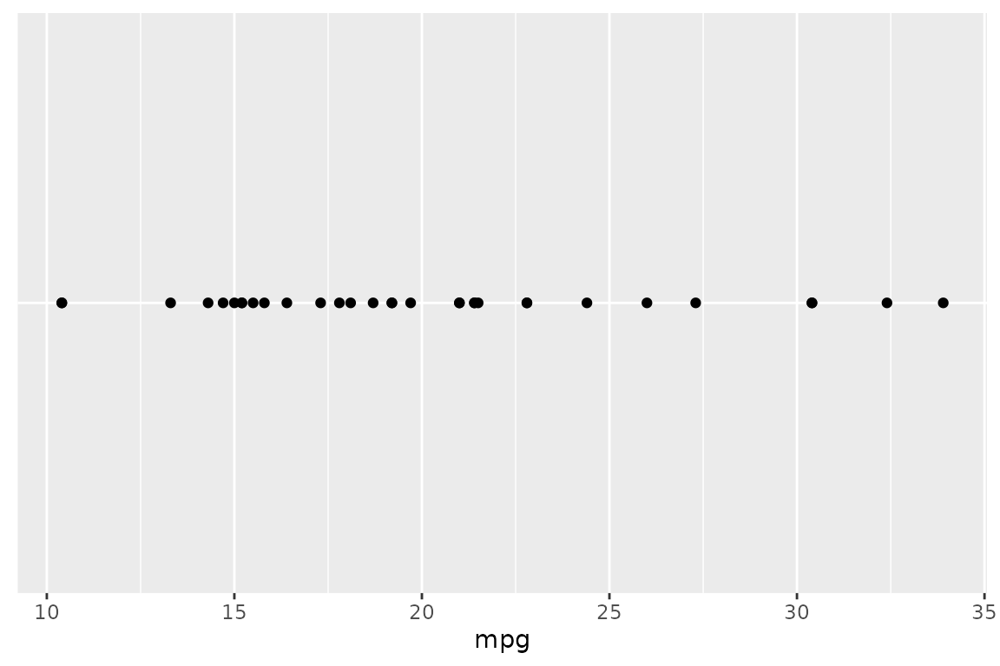

### Non-positional aesthetics

`color` maps a column to color:

``` r
dbGetPlot(con, "
  visualize
    hp as x,
    mpg as y,
    cyl as color
  from cars
  using points
")
```


`size` maps a column to point size:

``` r
dbGetPlot(con, "
  visualize
    hp as x,
    mpg as y,
    cyl as size
  from cars
  using points
")
```

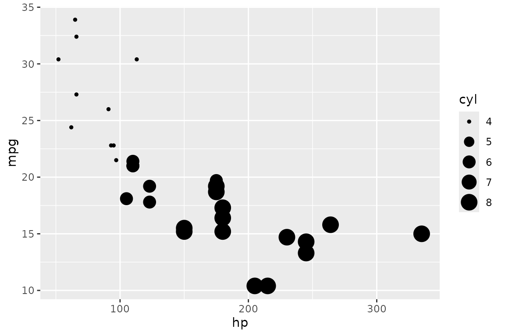

Multiple aesthetics can be combined:

``` r
dbGetPlot(con, "
  visualize
    hp as x,
    mpg as y,
    cyl as color,
    wt as size
  from cars
  using points
")
```

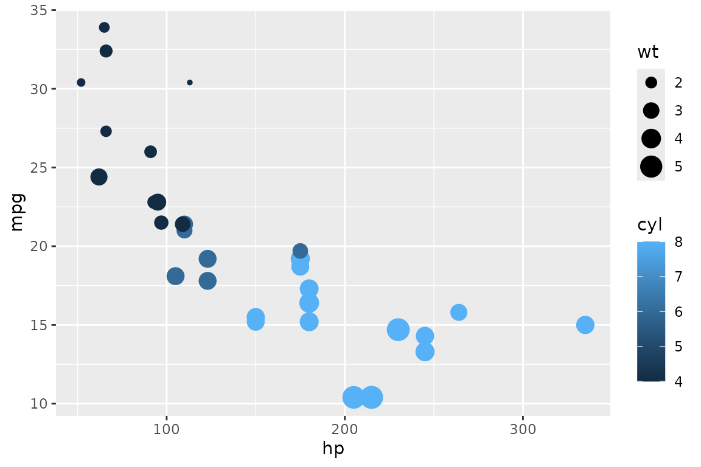

### Column expressions

Aesthetics can be mapped to expressions that include transformations or
aggregations, not just bare column names. The supported column-level
transformations and aggregations are covered in their own section below.

## The `using` clause

The `using` clause specifies which geometric object (geom) represents
the data. Both singular and plural forms are accepted as keywords.

### Points

`points` (or `point`) draws individual points — one per row:

``` r
dbGetPlot(con, "
  visualize
    hp as x,
    mpg as y
  from cars
  using points
")
```


### Bars

`bars` (or `bar`) draws bar segments. Bars are stacked by default when a
non-positional grouping is present:

``` r
dbGetPlot(con, "
  visualize
    cut as x,
    count(*) as y,
    color as color
  from diamonds
  group by
    cut, color
  using bars
")
```

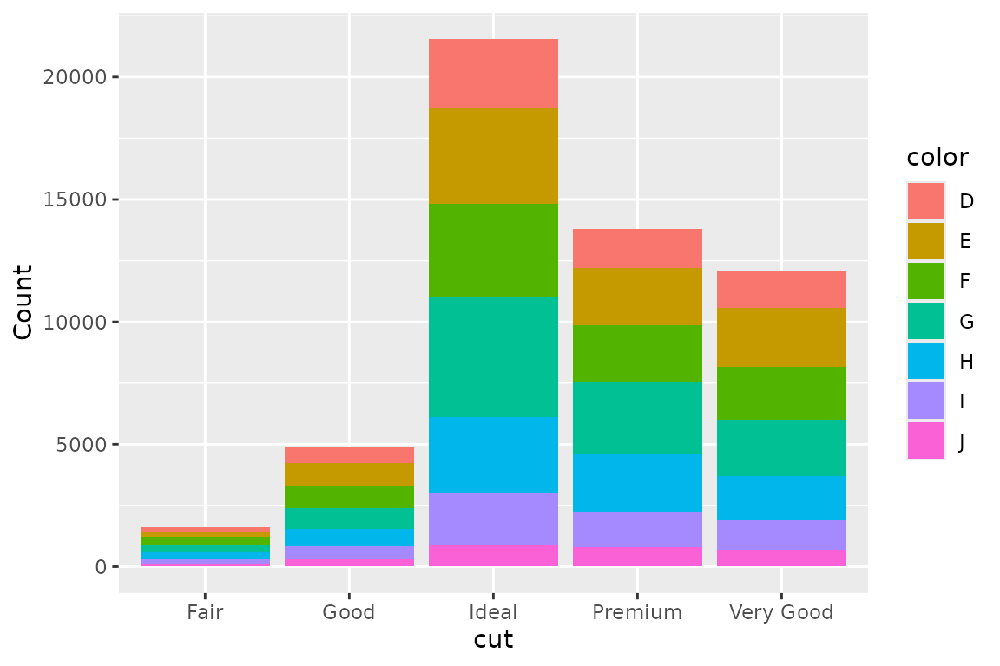

### Lines

`lines` (or `line`) draws connected lines. Lines are collective geoms —
they represent multiple rows with a single geometric object:

``` r
dbGetPlot(con, "
  visualize
    age as x,
    circumference as y
  from trees
  collect by
    Tree
  using lines
")
```


### Boxes

`boxes` (or `box`) draws box plots. Like lines, boxes are collective
geoms:

``` r
dbGetPlot(con, "
  visualize
    cut as x,
    price as y
  from diamonds
  using boxes
")
```

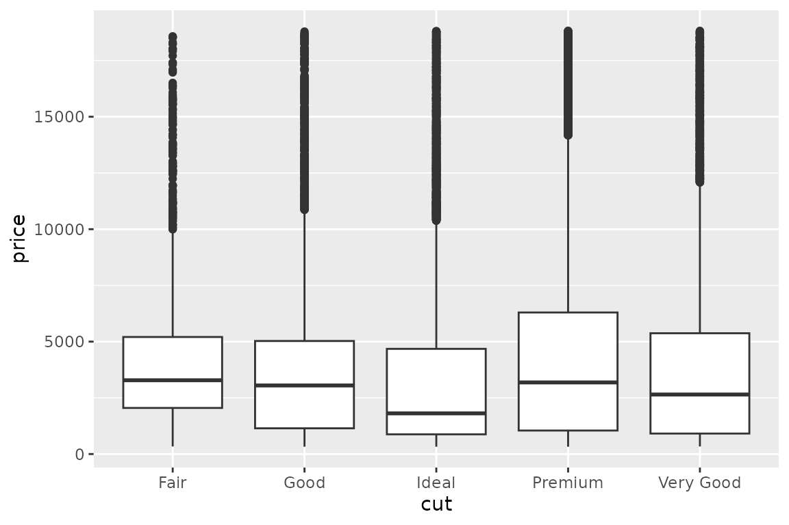

## Column-level transformations and aggregations

SGL supports transformations and aggregations as part of column
expressions in the `visualize` clause.

### `bin()`

The `bin()` transformation groups a continuous column into discrete
bins:

``` r
dbGetPlot(con, "
  visualize
    bin(mpg) as x,
    count(*) as y
  from cars
  group by
    bin(mpg)
  using bars
")
```

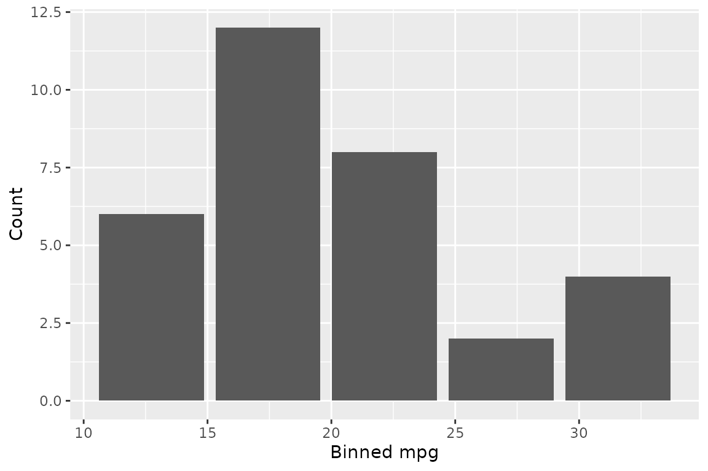

### `count()`

The `count(*)` aggregation counts rows per group. Any non-aggregated
column in the `visualize` clause must also appear in the `group by`
clause — the same rule as SQL:

``` r
dbGetPlot(con, "
  visualize
    cut as x,
    count(*) as y
  from diamonds
  group by
    cut
  using bars
")
```


### Combining transformations and aggregations

`bin()` and `count(*)` can be combined to produce histograms.
Non-positional groupings create stacked histograms:

``` r
dbGetPlot(con, "
  visualize
    bin(mpg) as x,
    count(*) as y,
    cyl_cat as color
  from (
    select
      *,
      cast(cyl as varchar) as cyl_cat
    from cars
  )
  group by
    bin(mpg),
    cyl_cat
  using bars
")
```

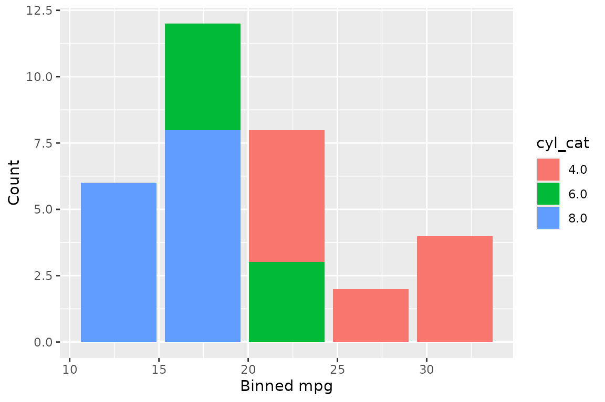

## The `group by` clause

The `group by` clause specifies grouping expressions for aggregations.
It follows the same semantics as SQL’s `GROUP BY`: any non-aggregated
expression in the `visualize` clause must appear in the `group by`
clause.

``` r
dbGetPlot(con, "
  visualize
    cut as x,
    count(*) as y
  from diamonds
  group by
    cut
  using bars
")
```

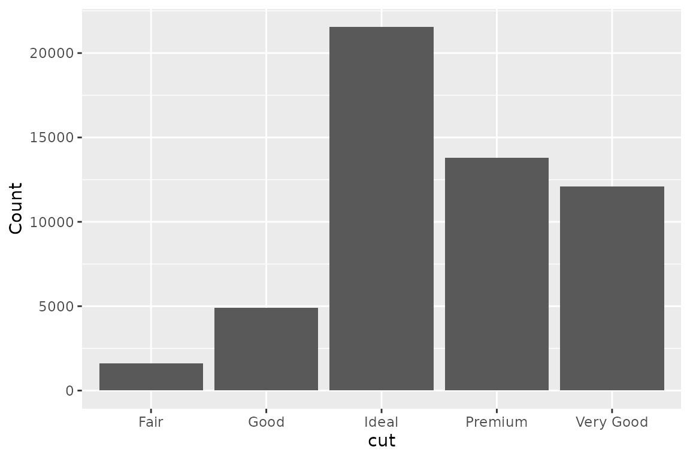

## The `collect by` clause

Collective geoms (lines and boxes) represent multiple rows with a single
geometric object. By default, the collection of rows is determined
implicitly. The `collect by` clause overrides this behavior, explicitly
specifying which column determines how rows are grouped into separate
geometric objects.

Without `collect by`, all rows feed into a single line:

``` r
dbGetPlot(con, "
  visualize
    age as x,
    circumference as y
  from trees
  using line
")
```


With `collect by`, each unique value of the specified column produces a
separate line:

``` r
dbGetPlot(con, "
  visualize
    age as x,
    circumference as y
  from trees
  collect by
    Tree
  using lines
")
```


## Geom qualifiers

Geom qualifiers are keywords placed before the geom name in the `using`
clause. They modify how the geom represents data.

### `jittered` (points)

Adds random positional variation to points, useful when data has
overlapping values:

``` r
set.seed(42)
dbGetPlot(con, "
  visualize
    cyl_cat as x,
    mpg as y
  from (
    select mpg, cast(cyl as varchar) as cyl_cat
    from cars
  )
  using jittered points
")
```

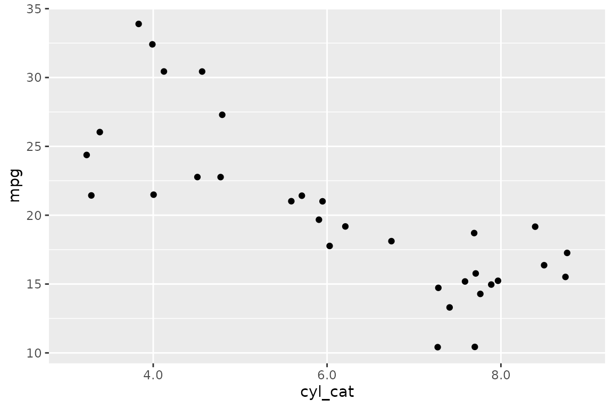

### `regression` (lines)

Fits a linear regression line instead of connecting data points:

``` r
dbGetPlot(con, "
  visualize
    hp as x,
    mpg as y
  from cars
  using regression line
")
#> `geom_smooth()` using formula = 'y ~ x'
```

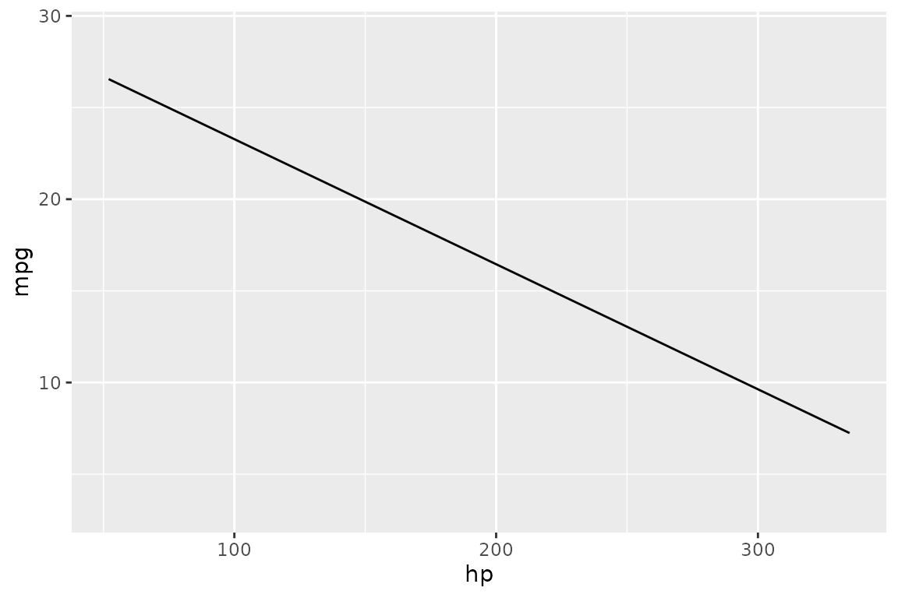

### `unstacked` (bars)

Positions bars side-by-side instead of stacking them:

``` r
dbGetPlot(con, "
  visualize
    cut as x,
    count(*) as y,
    color as color
  from diamonds
  group by
    cut, color
  using unstacked bars
")
```


## The `layer` operator

Multiple layers of geometric objects can be combined into a single
graphic using the `layer` keyword. Each layer is a complete
sub-statement with its own `visualize`, `from`, and `using` clauses:

``` r
dbGetPlot(con, "
  visualize
    hp as x,
    mpg as y
  from cars
  using points

  layer

  visualize
    hp as x,
    mpg as y
  from cars
  using regression line
")
#> `geom_smooth()` using formula = 'y ~ x'
```

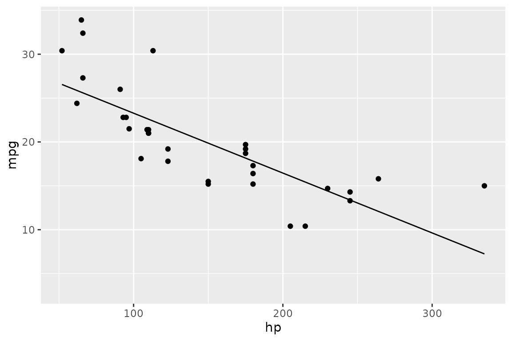

### Layered geom expressions

When layers share the same data source and aesthetic mapping, a
shorthand syntax avoids repetition. Geom expressions are listed inside
parentheses in the `using` clause, separated by `layer`:

``` r
dbGetPlot(con, "
  visualize
    hp as x,
    mpg as y
  from cars
  using (
    points
    layer
    regression line
  )
")
#> `geom_smooth()` using formula = 'y ~ x'
```


## The `scale by` clause

Each mapped aesthetic has a scale that determines how data values are
mapped to visual properties. Scales default to linear but can be
overridden with the `scale by` clause.

### Log scale

[`log()`](https://rdrr.io/r/base/Log.html) applies a base-10 logarithmic
scale to an aesthetic:

``` r
dbGetPlot(con, "
  visualize
    hp as x,
    mpg as y
  from cars
  using (
    points
    layer
    regression line
  )
  scale by
    log(x),
    log(y)
")
#> `geom_smooth()` using formula = 'y ~ x'
```


Note that scaling is applied to the aesthetic, not to the data. This
means the regression in the example above is computed on the log-scaled
values. To transform the data itself, use SQL in the `from` clause:

``` r
dbGetPlot(con, "
  visualize
    log_hp as x,
    log_mpg as y
  from (
    select
      log(hp) as log_hp,
      log(mpg) as log_mpg
    from cars
  )
  using (
    points
    layer
    regression line
  )
")
#> `geom_smooth()` using formula = 'y ~ x'
```

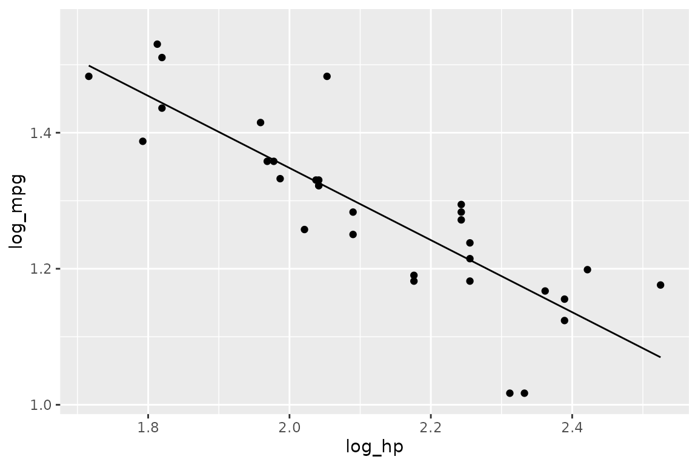

## Coordinate systems

The coordinate system is inferred from the positional aesthetics in the
`visualize` clause. `x` and `y` imply Cartesian coordinates. `theta` and
`r` imply polar coordinates.

A pie chart is a stacked bar chart rendered in polar coordinates:

``` r
dbGetPlot(con, "
  visualize
    count(*) as theta,
    cut as color
  from diamonds
  group by
    cut
  using bars
")
```

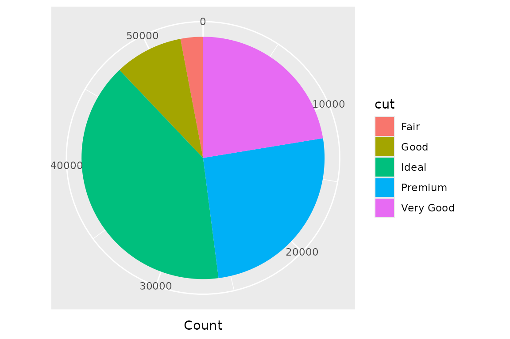

## The `facet by` clause

Faceting generates small multiples — separate panels for each unique
value of a column. A single facet expression produces horizontal panels
by default:

``` r
dbGetPlot(con, "
  visualize
    hp as x,
    mpg as y
  from cars
  using points
  facet by
    cyl
")
```


The orientation can be changed with the `vertically` keyword:

``` r
dbGetPlot(con, "
  visualize
    hp as x,
    mpg as y
  from cars
  using points
  facet by
    cyl vertically
")
```


Two facet expressions produce a grid — one varies horizontally, the
other vertically:

``` r
dbGetPlot(con, "
  visualize
    hp as x,
    mpg as y
  from cars
  using points
  facet by
    cyl,
    am
")
```

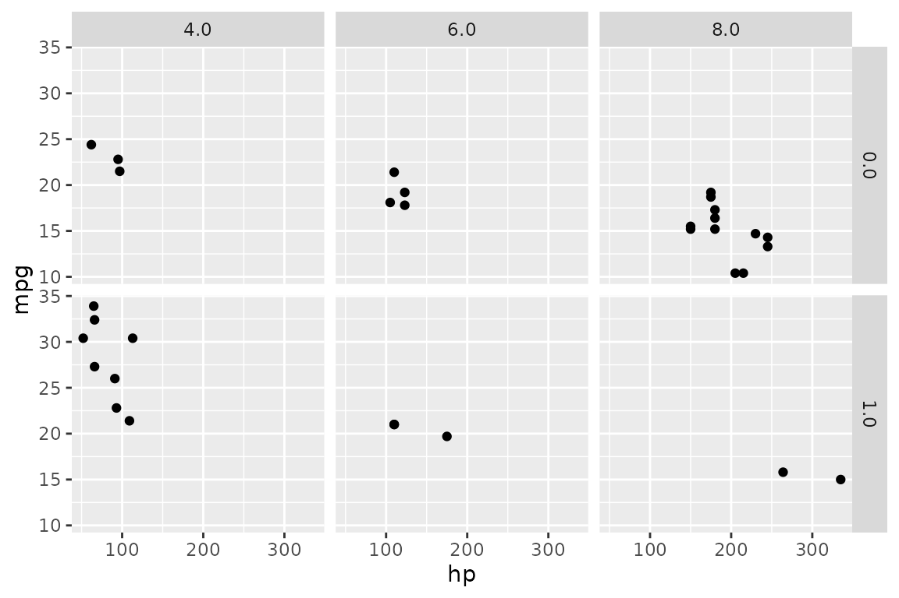

## The `title` clause

Axis and legend titles are automatically derived from aesthetic
mappings. The `title` clause overrides these defaults:

``` r
dbGetPlot(con, "
  visualize
    hp as x,
    mpg as y,
    cyl as color
  from cars
  using points
  title
    x as 'Horsepower',
    y as 'Miles Per Gallon',
    color as 'Cylinders'
")
```

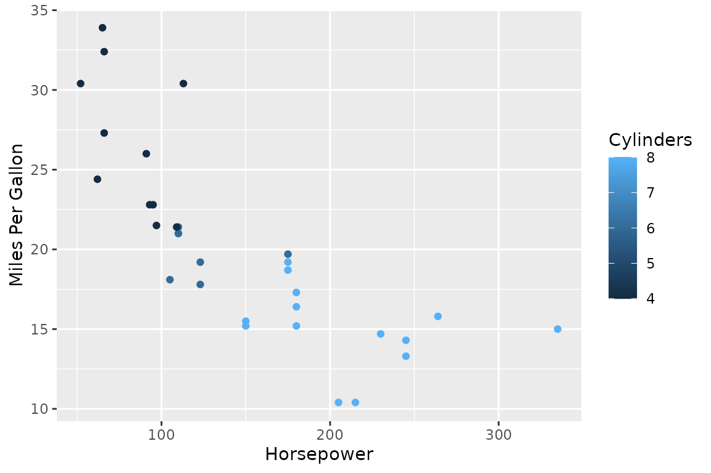
