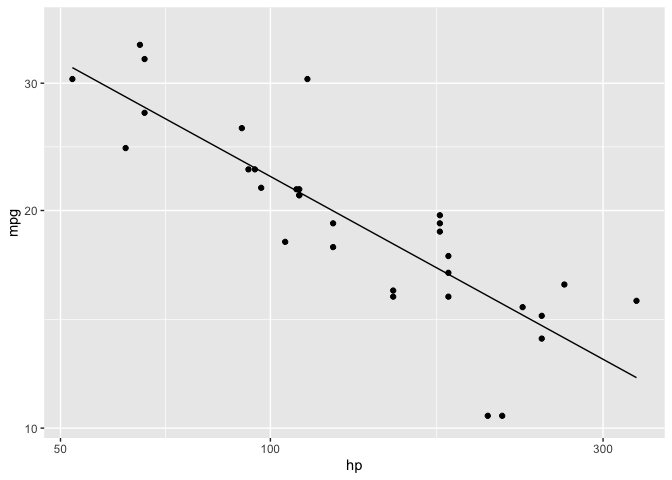

# rsgl

rsgl implements [SGL (Structured Graphics
Language)](https://arxiv.org/pdf/2505.14690), a declarative language for
specifying statistical graphics that is designed to feel like SQL. You
write a SGL statement, pass it to
[`dbGetPlot()`](https://sgl-projects.github.io/rsgl/reference/dbGetPlot.md)
with a DuckDB connection, and get back a ggplot2 plot.

## Installation

You can install rsgl from GitHub with:

``` r
# install.packages("remotes")
remotes::install_github("sgl-projects/rsgl")
```

## Examples

### Scatterplot

``` r
dbGetPlot(con, "
  visualize
    hp as x,
    mpg as y,
    cyl as color
  from cars
  using points
")
```


### Histogram

``` r
dbGetPlot(con, "
  visualize
    bin(mpg) as x,
    count(*) as y
  from cars
  group by
    bin(mpg)
  using bars
")
```


### Scatterplot with regression line

``` r
dbGetPlot(con, "
  visualize
    hp as x,
    mpg as y
  from cars
  using (
    points
    layer
    regression line
  )
  scale by
    log(x)
")
#> `geom_smooth()` using formula = 'y ~ x'
```



### Faceted box plot

``` r
dbGetPlot(con, "
  visualize
    cyl_cat as x,
    mpg as y
  from (
    select mpg, cast(cyl as varchar) as cyl_cat, am
    from cars
  )
  using boxes
  facet by
    am
")
```


## Learn more

- [`vignette("rsgl")`](https://sgl-projects.github.io/rsgl/articles/rsgl.md)
  — Get started with rsgl
- [`vignette("sgl-language-guide")`](https://sgl-projects.github.io/rsgl/articles/sgl-language-guide.md)
  — Full SGL syntax reference
