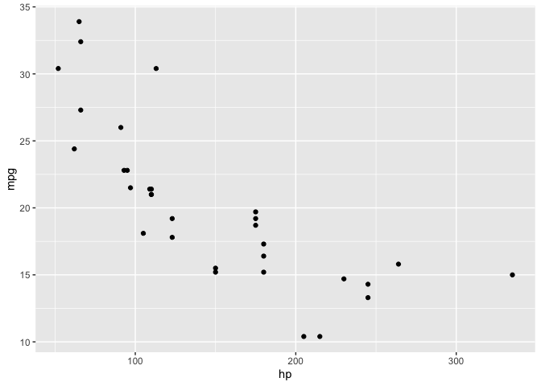

# rsgl

This project implements the [SGL graphics
language](https://arxiv.org/pdf/2505.14690).

## Usage

The interface to rsgl is the `dbGetPlot` function, which takes a DBI
connection and a SGL statement and returns a plot. The example below
demonstrates creating an in-memory DuckDB database, loading data, and
generating a scatterplot.

``` r

library(duckdb)
#> Loading required package: DBI
library(rsgl)

con <- dbConnect(duckdb())
dbWriteTable(con, "cars", mtcars)
dbGetPlot(con, "
    visualize
        hp as x,
        mpg as y
    from cars
    using points
")
```


